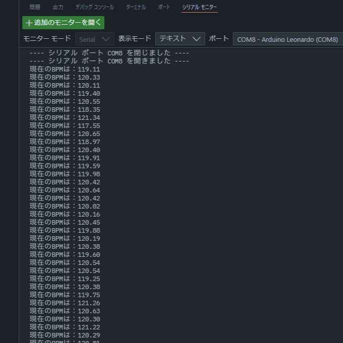
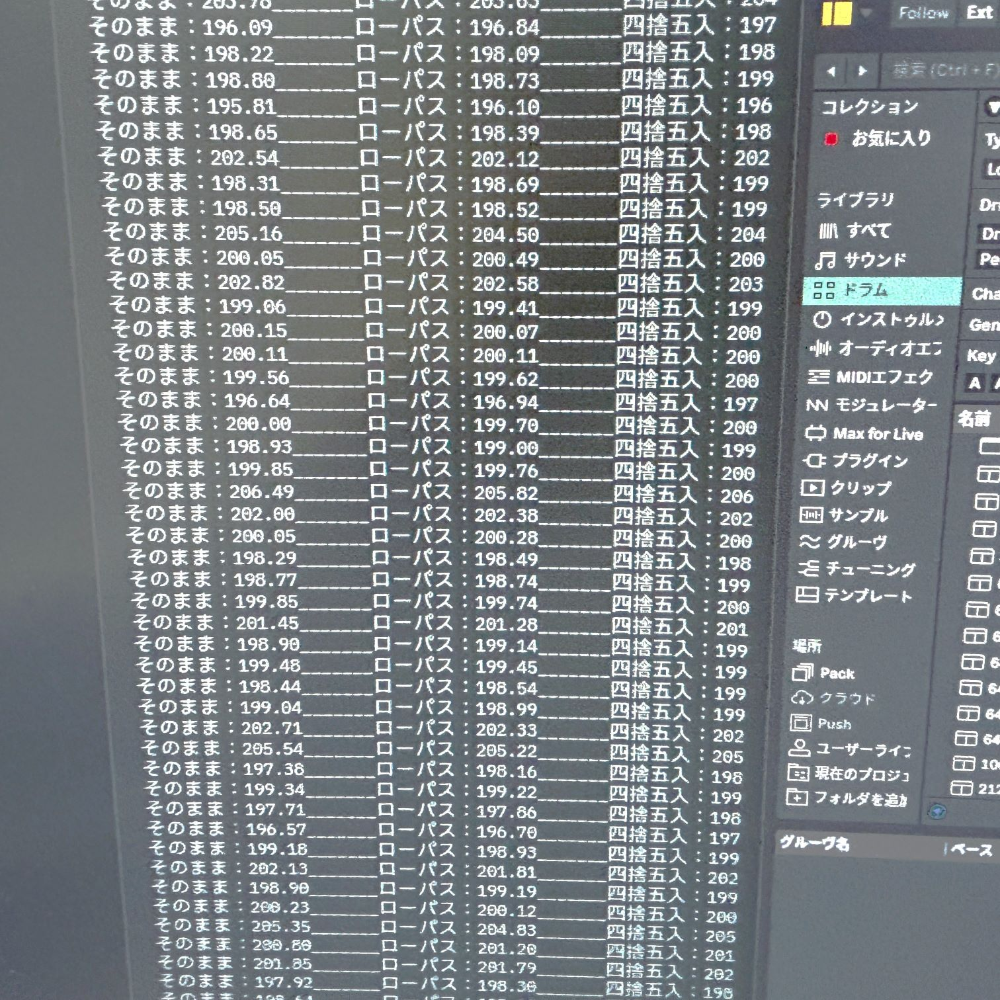
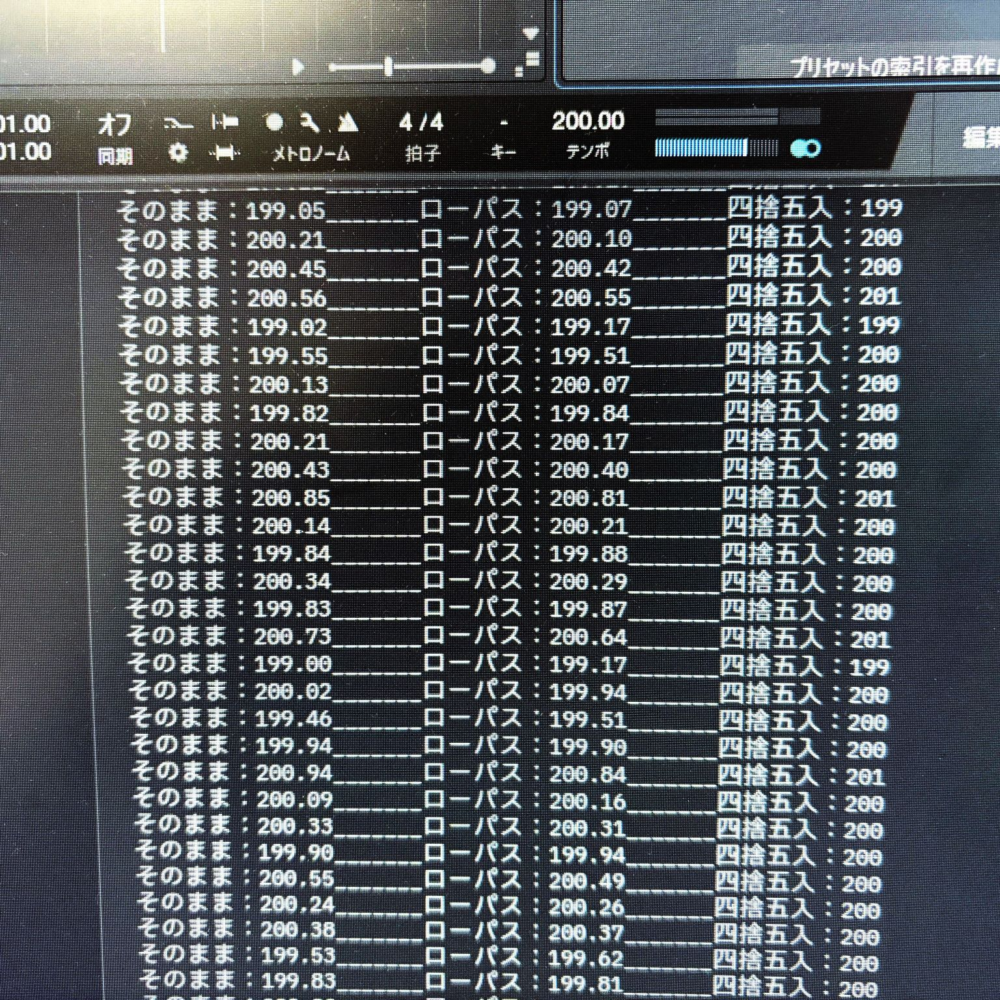

[MIDI](../tags/midi.md) | [Arduino](../tags/arduino.md)

# {{ $frontmatter.title }}

## はじめに

[「ぼくがかんがえたさいきょうのMIDIコントローラー」](./20240915)を作る過程で副産物が少しばかり生まれたので、可能な範囲で書き起こします。諸々の前提知識をすっ飛ばしますのでご了承ください。

ソースコードはGitHubにも載せています。

https://github.com/aSumo-1xts/MIDI-HARD/tree/main/Arduino/Clock-and-BPM

## 環境

- Windows 11
- Arduino IDE 2.3.3
- Ableton Live 12 Suite

## 背景と目的

ArduinoでAbleton LiveからBPMを取得したいです。適当に検索をかけるとArduino側をMIDIクロックジェネレータとして運用する方法が多くヒットしますが、実際の演奏場面を考えるとクロックの主導権はLive側に握らせた方が安心です。

DAWによってはMIDIタイムコードという内部データ的なものを吐き出してくれるんですが、Ableton Liveは[公式のヘルプページ](https://help.ableton.com/hc/ja/articles/209071149-MIDI%E3%81%A7Live%E3%82%92%E5%90%8C%E6%9C%9F%E3%81%99%E3%82%8B "MIDIでLiveを同期する")曰く

> MIDIタイムコード（MTC）の出力： Liveは受信するMIDIタイムコードと同期することができますが、Liveだけでは、MIDIタイムコードを送信することができません。ただし、 MIDIタイムコードを出力するMaxのデバイス を利用することができます（Max Runtimeが必要です）。

とのことなので、タイムコードは諦めて

1. Liveから同期クロックを出力
2. Arduinoで受信してBPMに変換

の方向性で行くことにしました。

**もっともPushシリーズは普通にBPMの読み書きが可能なので、タイムコードの機能自体は備わっていて我々に解放されていないだけなんじゃないかと疑っていますが…**

## スケッチ

実は[MIDIUSBライブラリ](https://github.com/arduino-libraries/MIDIUSB.git "MIDIUSB Library for Arduino")の`example`ディレクトリに、本記事と全く同じ目的で書かれた`MIDIUSB_clock.ino`なるスケッチが存在します。これを下敷きにしつつ、[フォーラム](https://forum.arduino.cc/t/missing-midi-in-messages-with-midiusb-library-and-arduino-micro/453585 "Missing Midi In messages with MIDIUSB library and Arduino Micro")なども参考にしました。

### ベーシックver

コメントアウトを出鱈目に英語で書いてしまったのでアレですが、大体の流れは以下の通りです。

1. DAWからは1/24拍の間隔でクロックが送られてくる
2. これをカウントしておいて、24クロックになったら1拍として記録
3. BPMに換算（カウントはリセット）

特に`getSerialMIDI`関数の`0xF8`なる定数、こいつが構造体`midiEventPacket_t`の先頭として飛び込んできたら「クロックが来たぞ！」の合図になるようです。

ほとんど同じ仕組みで、MIDIUSBライブラリじゃなく[Control Surfaceライブラリ](https://github.com/tttapa/Control-Surface.git "Control Surface")を使って書くこともできました。Control Surfaceはめちゃくちゃ便利な神ライブラリです。

::: code-group 
```cpp [getBPM-MIDIUSB.ino]
#include <MIDIUSB.h>


void getSerialMIDI(int16_t *vals) {
    int16_t kago[3] = {-1, -1, -1};
    midiEventPacket_t rx;       // Open the mailbox. If empty, header=0.

    do {                        // Retrieve received letters and store them in kago.
        rx = MidiUSB.read();
        if (rx.header != 0) {
            kago[0] = rx.byte1; // read command byte
            kago[1] = rx.byte2; // read next byte
            kago[2] = rx.byte3; // read final byte
        }
    } while (rx.header != 0);   // Repeat until mailbox is empty.

    for (uint8_t i=0; i<3; i++) {
        vals[i] = kago[i];
    }
}


uint16_t    BPM       = 0;  //!< global BPM
uint8_t     ppqn      = 0;  //!< 24 Pulses Per Quarter Note
uint32_t    startTime = 0;  //!< for Timer
void clock2BPM() {
    float   preBPM = 0;         // temporary BPM as a result of a single calculation
    int16_t MIDIvals[3];        // means kago

    getSerialMIDI(MIDIvals);    // Bring the letters from the mailbox into the living room.

    if (MIDIvals[0] == 0xF8) {  // System Realtime Message about Clock.
        if (ppqn == 0) {                        // the first Clock
            startTime = micros();               // start Timer
        }
        ppqn++;                                 // count up Clock

        if (ppqn > 24) {                        // 24 Clocks = 1 bar
            preBPM  = 6.0e+07 / float(micros() - startTime);    // stop Timer, calculate BPM
            if(20 <= preBPM && preBPM <= 999) {                 // adopt if reasonable
                BPM = round(preBPM);
            }
            Serial.println(BPM);                // or just "Serial.println(preBPM)"
            ppqn = 0;                           // reset Clock
        }
    }
}


//! @brief setup function
void setup() {
    Serial.begin(115200);
}


//! @brief loop function
void loop() {
    clock2BPM();
}
```

```cpp [getBPM-Control_Surface.ino]
#include <Control_Surface.h>
USBMIDI_Interface midi_usb;


uint16_t  BPM       = 0;  //!< global BPM
uint8_t   ppqn      = 0;  //!< 24 Pulses Per Quarter Note
uint32_t  startTime = 0;  //!< for Timer
bool realTimeMessageCallback(RealTimeMessage rt) {
    float preBPM = 0;                   // temporary BPM as a result of a single calculation

    if (ppqn == 0) {                    // the first Clock
        startTime = micros();           // start Timer
    }
    ppqn++;                             // count up Clock

    if (ppqn > 24) {                    // 24 Clocks = 1 bar
        preBPM  = 6.0e+07 / float(micros() - startTime);    // stop Timer, calculate BPM
        if(20 <= preBPM && preBPM <= 999) {                 // adopt if reasonable
            BPM = round(preBPM);
        }
        Serial.println(BPM);            // or just "Serial.println(preBPM)"
        ppqn = 0;                       // reset Clock
    }

    return true;
}


//! @brief setup function
void setup() {
    Control_Surface.begin();
    Control_Surface.setMIDIInputCallbacks(nullptr, nullptr, nullptr, realTimeMessageCallback);
}


//! @brief loop function
void loop() {
    Control_Surface.loop();
}
```
:::

Control Surface版は動作の最中にArduino IDEのシリアルモニタを開閉すると何故か停止しますが、実際の使用状況ではそもそもIDEを開かないのでヨシ！としています。とは言えあまり健全ではないので、ゆるゆると原因調査中です。

#### 結果

Liveの再生ボタンを押してBPM=120のクロックを読み込ませたところ、とりあえずBPMを教えてくれました（利用するライブラリに関わらず同様です）。しかしながら、BPM=120のはずなのに値がかなりブレブレです。このあとBPM=200とかになるともっと酷いことになりました。



### 誤差低減ver

何とかならないかと思い、四捨五入やらローパスフィルタやら色々と試してみましたが結果はあまり芳しくなかったです（上、スクショ撮り忘れ）。ちなみにLiveよりStudio Oneの方がクロック精度は高いようで（下）、なぜなんだ～と思いつつ手を引くことにしました。





## おわりに

あわよくばArduino側で7セグLEDを使ってBPMを逐一表示～とか妄想してたんですが、こうも値がブレると演奏中には逆効果です。電源周りとかも含めてそれなりに色々試したんですが今のところ効果は無いので、何か改善案をお持ちの方がいたら是非お知らせください。今のままでも単純にLEDを点滅させれば視覚的なメトロノームぐらいにはなるかな…

---
