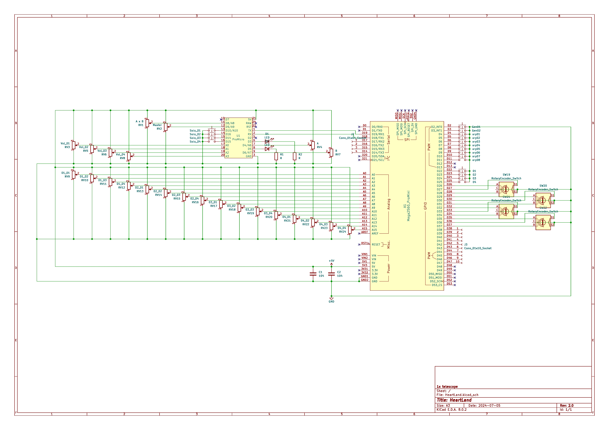
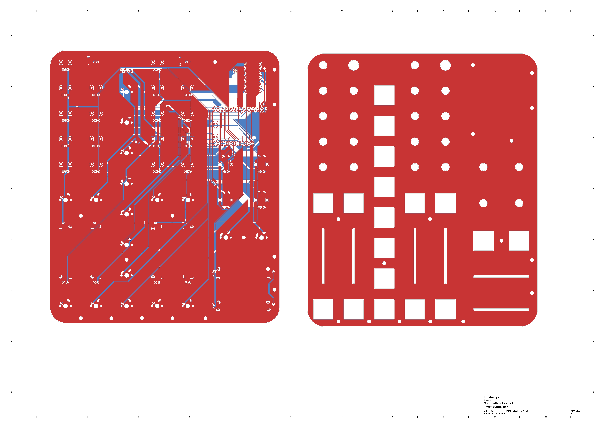

[その他の工作](../tags/otherdiy.md) | [MIDI](../tags/midi.md) | [Arduino](../tags/arduino.md)

# {{ $frontmatter.title }}

## はじめに

「ぼくがかんがえたさいきょうのMIDIコントローラー」を作ったので、その工程をまとめました。ソースコードや回路図はGitHubにも載せています。

https://github.com/aSumo-1xts/MIDI-HARD/tree/main/HeartLand

## 環境

- Windows 11
- Arduino IDE 2.3.3
- KiCad 8.0.2
- Ableton Live 12 Suite

## 背景と目的

Ableton LiveでDJをやりたいんですが、MIDIコントローラーの選択肢が少なすぎる！求める機能をそれなりに備えているのはAkai APC40 mk2ですが、高額な上に球数も少ないので故障時のことが怖いです。海外には[セミオーダーできるところ](https://yaeltex.com)もあるようですが、とても趣味に出せる金額ではありません…

仕方がないので自分で作ることにしました。

## 構想

### 仕組み

ノブやフェーダやボタン、つまりは入力をたくさん用意したいので、単にArduinoボードを1台用意するだけでは端子が足りません。そこでArduinoを2台用意して「daughter」「mother」と名付け、以下のように役割を振りました。


抽象度が高すぎて何のこっちゃという感じですが、ざっくり説明すると

**daughter**
- ノブ等からの入力を読み込んでMIDIメッセージを生成、motherへ送る
- 入力端子が多いのでとにかく沢山読み込む

**mother**
- ノブ等からの入力を読み込んでMIDIメッセージを生成、daughterから送られた分とマージしてPCへ送る
- daughterだけでは手の足りていないアナログ入力を主に読み込む

という感じで、そんなに難しいことはしていません。

マルチプレクサやシフトレジスタを使って入力を増やす方法もあるのですが、仕組みや回路を考えるのに少しばかり頭を使います。その点Arduinoなら直感的に繋いでコーディングするだけですし、ジェネリック品で良ければアリエクなどで割と安価に入手できます。

ちなみにdaughterとmotherをこの組み合わせで運用する場合、**仕様上Mega2560 ProMiniはPC側からUSBデバイスとして認識させることが出来ません**ので、必ずProMicroがmotherになる必要があります（一敗）。

### 外装

3Dプリンターやらアルミシャーシやら考えましたが、とりあえず基板を2枚重ねる方式を採用することにしました。回路が走る基板の上にスペーサをかませて、ガワとして同じ大きさの回路なし基板を乗せるやり方です。ゴミが入りやすいという最大の難点を無視すれば、そんなに悪くはないでしょう。

## 設計

### 回路



本記事冒頭のGitHubリポジトリにPDF版があるので、必要に応じてご参照ください。細かい話ですが、C1とC2のパスコンは実際には各Arduinoへ一つずつ使っています。

なおArduinoのKICAD用シンボルは有志の方が公開しているものをお借りしました。本記事の末尾にまとめてリンクを貼っておきます。ダウンロードして自分のKICADで使えるようになるまでに一苦労あった気がするのですが、忘れてしまいました…

### ソースコード

[Control-Surfaceなる神ライブラリ](https://github.com/tttapa/Control-Surface)のおかげで簡潔かつスムーズに書けました。exampleディレクトリを見れば大体何でもできるようになっています。

個人的な工夫として、MIDIチャンネルを指定する箇所ではあえて同ライブラリの内部関数を用い、冒頭の変数で一括変更できるようにしました。

::: code-group
```cpp [heartLand_daughter.ino]
/**
 * @file        heartLand_daughter.ino
 * @author      aSumo (1xtelescope@gmail.com)
 * @brief       a sketch for Mega2560 ProMini in USB-MIDI Controller "HeartLand"
 * @version     1.0
 * @date        2024-06-26
 * @copyright   GPL-3.0
 * @details     Just send serial MIDI message from Serial1 to "mother"
 */

//! https://github.com/tttapa/Control-Surface.git
#include <Control_Surface.h>
//! 単純なシリアル通信のためのインスタンス
SerialMIDI_Interface<decltype(Serial1)> midi_ser {Serial1, MIDI_BAUD};

/* ↓↓↓↓↓↓↓↓↓↓↓↓↓↓↓ variable to change ↓↓↓↓↓↓↓↓↓↓↓↓↓↓↓ */

uint8_t ch[3]       = {2, 3, 4};    //!< MIDIチャンネルの管理
uint8_t BPM_multi   = 5;            //!< BPM用エンコーダの係数
uint8_t enc_multi   = 5;            //!< 汎用エンコーダの係数

/* ↑↑↑↑↑↑↑↑↑↑↑↑↑↑↑ variable to change ↑↑↑↑↑↑↑↑↑↑↑↑↑↑↑ */


uint8_t util01 = 2;     //!< 余りその1
uint8_t util02 = 3;     //!< 余りその2


CCAbsoluteEncoder enc[] = {
    {{26, 28}, {3, Channel::createChannel(ch[0])}, BPM_multi, }, // enc01
    {{29, 31}, {4, Channel::createChannel(ch[0])}, enc_multi, }, // enc02
    {{32, 34}, {5, Channel::createChannel(ch[0])}, enc_multi, }, // enc03
    {{35, 37}, {6, Channel::createChannel(ch[0])}, enc_multi, }, // enc04
};


CCButton sw[] = {
    {27, {7,  Channel::createChannel(ch[0])}, }, // enc_sw01
    {30, {8,  Channel::createChannel(ch[0])}, }, // enc_sw02
    {33, {9,  Channel::createChannel(ch[0])}, }, // enc_sw03
    {36, {10, Channel::createChannel(ch[0])}, }, // enc_sw04

    {4,  {11, Channel::createChannel(ch[0])}, }, // ary01
    {5,  {12, Channel::createChannel(ch[0])}, }, // ary02
    {6,  {13, Channel::createChannel(ch[0])}, }, // ary03
    {7,  {14, Channel::createChannel(ch[0])}, }, // ary04
    {8,  {15, Channel::createChannel(ch[0])}, }, // ary05
    {9,  {16, Channel::createChannel(ch[0])}, }, // ary06
    {10, {17, Channel::createChannel(ch[0])}, }, // ary07
    {11, {18, Channel::createChannel(ch[0])}, }, // ary08

    {22, {6,  Channel::createChannel(ch[1])}, }, // Sw01
    {23, {7,  Channel::createChannel(ch[1])}, }, // Sw02
    
    {24, {6,  Channel::createChannel(ch[2])}, }, // Sw03
    {25, {7,  Channel::createChannel(ch[2])}, }, // Sw04
};


CCPotentiometer pot[] = {
    {A0,  {8,  Channel::createChannel(ch[1])}, }, // pot01_01
    {A1,  {9,  Channel::createChannel(ch[1])}, }, // pot01_02
    {A2,  {10, Channel::createChannel(ch[1])}, }, // pot01_03
    {A3,  {11, Channel::createChannel(ch[1])}, }, // pot01_04
    {A4,  {12, Channel::createChannel(ch[1])}, }, // pot02_01
    {A5,  {13, Channel::createChannel(ch[1])}, }, // pot02_02
    {A6,  {14, Channel::createChannel(ch[1])}, }, // pot02_03
    {A7,  {15, Channel::createChannel(ch[1])}, }, // pot02_04

    {A8,  {8,  Channel::createChannel(ch[2])}, }, // pot03_01
    {A9,  {9,  Channel::createChannel(ch[2])}, }, // pot03_02
    {A10, {10, Channel::createChannel(ch[2])}, }, // pot03_03
    {A11, {11, Channel::createChannel(ch[2])}, }, // pot03_04
    {A12, {12, Channel::createChannel(ch[2])}, }, // pot04_01
    {A13, {13, Channel::createChannel(ch[2])}, }, // pot04_02
    {A14, {14, Channel::createChannel(ch[2])}, }, // pot04_03
    {A15, {15, Channel::createChannel(ch[2])}, }, // pot04_04
};


//! @brief setup関数
void setup() {
    pinMode(util01, INPUT_PULLUP);
    pinMode(util02, INPUT_PULLUP);
    
    Control_Surface.begin();
}

//! @brief loop関数
void loop() {
    Control_Surface.loop();
}
```

```cpp [heartLand_mother.ino]
/**
 * @file        heartLand_mother.ino
 * @author      aSumo (1xtelescope@gmail.com)
 * @brief       a sketch for ProMicro in USB-MIDI Controller "HeartLand"
 * @version     1.0
 * @date        2024-06-26
 * @copyright   GPL-3.0
 * @details     Merge MIDI message; "daughter"s one and mine, and TX/RX with USB
 */

//! https://github.com/tttapa/Control-Surface.git
#include <Control_Surface.h>
//! Instantiate a MIDI over USB interface
USBMIDI_Interface midi_usb;
//! Instantiate a 5-pin DIN MIDI interface
HardwareSerialMIDI_Interface midi_ser {Serial1, MIDI_BAUD};
//! Create a MIDI pipe factory with 3 pipes
BidirectionalMIDI_PipeFactory<3> pipes;

/* ↓↓↓↓↓↓↓↓↓↓↓↓↓↓↓ variable to change ↓↓↓↓↓↓↓↓↓↓↓↓↓↓↓ */

uint8_t ch[3]   = {2, 3, 4};    //!< MIDIチャンネルの管理
uint8_t minPWM  = 0;            //!< LED最暗値
uint8_t maxPWM  = 255;          //!< LED最明値

/* ↑↑↑↑↑↑↑↑↑↑↑↑↑↑↑ variable to change ↑↑↑↑↑↑↑↑↑↑↑↑↑↑↑ */


uint8_t LEDpin[2] = {3, 5};     //!< indicator


CCButton sw[] = {
    {10,  {1, Channel::createChannel(ch[1])}, }, // Solo01
    {14,  {2, Channel::createChannel(ch[1])}, }, // Solo02

    {15,  {1, Channel::createChannel(ch[2])}, }, // Solo03
    {16,  {2, Channel::createChannel(ch[2])}, }, // Solo04
};


CCPotentiometer pot[] = {
    {A8, {1, Channel::createChannel(ch[0])}, }, // A x B
    {A9, {2, Channel::createChannel(ch[0])}, }, // Master

    {A0, {3, Channel::createChannel(ch[1])}, }, // Vol01
    {A1, {4, Channel::createChannel(ch[1])}, }, // Vol02
    {A6, {5, Channel::createChannel(ch[1])}, }, // FX_A

    {A2, {3, Channel::createChannel(ch[2])}, }, // Vol03
    {A3, {4, Channel::createChannel(ch[2])}, }, // Vol04
    {A7, {5, Channel::createChannel(ch[2])}, }, // FX_B
};


//! @brief setup関数
void setup() {
    Control_Surface | pipes | midi_usb;
    Control_Surface | pipes | midi_ser;
    
    midi_ser | pipes | midi_usb;    // Manually route Serial to USB / USB to Serial
    MIDI_Interface::beginAll();     // Initialize the MIDI interfaces

    Control_Surface.begin();

    Control_Surface.setMIDIInputCallbacks(nullptr, nullptr, nullptr, realTimeMessageCallback);
}

//! @brief loop関数
void loop() {
    Control_Surface.loop();
}


float     BPM       = 0;  //!< グローバルBPM
uint8_t   ppqn      = 0;  //!< 24 Pulses Per Quarter Note
uint32_t  startTime = 0;  //!< カウント開始時刻
/**
 * @brief       なんかよく解らんけどsetHandleClockの代わり！使用中はシリアルモニタを絶対に開かないこと
 * @param rt    これも謎パラメータ
 */
bool realTimeMessageCallback(RealTimeMessage rt) {
    float preBPM = 0;   // 一旦の計算結果としてのBPM 

    if(ppqn == 0) {
        startTime = micros();
        analogWrite(LEDpin[0], minPWM);
    }
    ppqn++;             // カウントアップ

    if(ppqn > 24) {     // 24回＝1拍
        preBPM  = 6.0e+07 / float(micros() - startTime); 

        if(20 <= preBPM && preBPM <= 999) {
            BPM = preBPM;
        }               // preBPMが有効な数字であるならば、BPMとして採用
        
        analogWrite(LEDpin[0], maxPWM);
        ppqn = 0;       // カウントリセット
    }

    return true;
}
```
:::

mother側では、DAWからクロックを受けてLEDをメトロノーム的に光らせる機能を盛り込んでいます。詳細は[こちらの記事](./DAW2BPM)にて。

### 基板

普段エフェクターを作ったりするときは自分で配線まで考えるのですが、今回はちょっと大変だったので[自動配線ツール](https://freerouting.mihosoft.eu/)を利用して電源ラインだけ手直ししました。本当はもっと拘るべきですが、まあ趣味のものなので最終的に問題なく動作していればOKとさせてください。

表側の基板（部品を載せないガワの方）にも両面GNDベタを施しておくと、強度がかなり上がってたわみにくくなります。これまた本当はノイズなどの影響を吟味すべきですが、とりあえず目先の実用性をとっています。




ボタンはキーボード用のCherry MXのやつを採用することにしました。軸とキーキャップを選べて楽しいです。フェーダのフットプリントの選択に少し悩みましたが、KICADにデフォルトで入っている`Potentiometer_THT:Potentiometer_Bourns_PTA4543_Single_Slide`を使えば[秋月で売っているやつ](https://akizukidenshi.com/catalog/g/g109238/)がそのまま使えました。

## 組み立て・完成

基板発注はJLCPCBで行いました。はんだ付けをして、ねじを締めて、諸々を取り付けて完成です。


製作途中の写真は撮り忘れました…。各部品の調達先をまとめておきます。

|部品|調達先|備考|
|----|----|----|
|Arduino|AliExpress|セールを狙うとさらに安い|
|Cherry MXボタン|Amazon|Gateronもあり|
|フェーダ|秋月|品質はめちゃくちゃ良いとは言えないかも|
|ボリューム|Tayda Erectronics|Dシャフトで堅牢|
|ロータリーエンコーダ|Tayda Erectronics|国内では見ない20クリックのものが買える|

## おわりに

完成してから数週間が経過しましたが、今のところ全機能きちんと使えています。

開発にあたって試作を繰り返す中でかなりの額を費やしたので最初から既製品を買っときゃ良かったじゃん！と思わないでもないですが、この先こいつが壊れても安価にもう一台もう一台と用意できるのは心強いです。上澄みとしてこの記事を残しておくので、皆さん軽率に理想のMIDIコンを作ってみてください！

## 参考

### KICAD用シンボル/フットプリント

Arduino ProMicro

https://github.com/g200kg/kicad-lib-arduino

Arduino Mega2560 ProMini

https://github.com/Alarm-Siren/arduino-kicad-library

---
